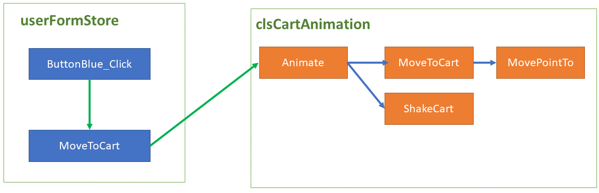
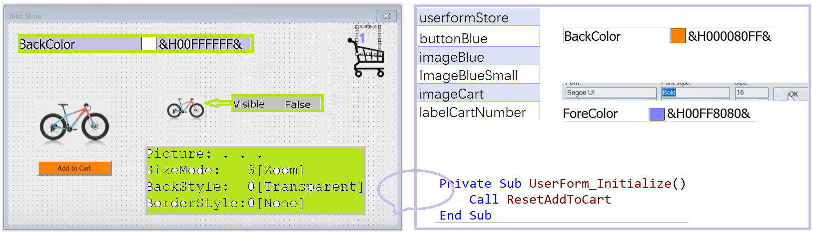
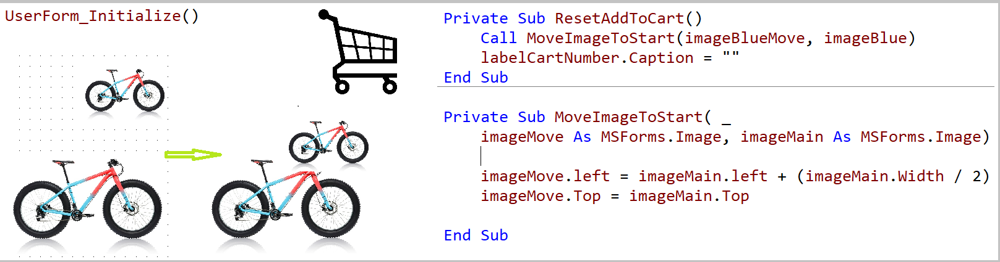
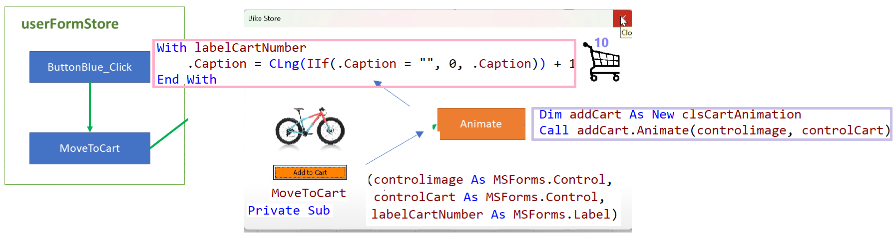
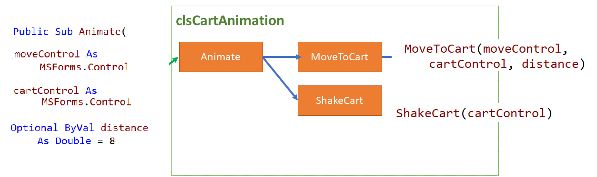
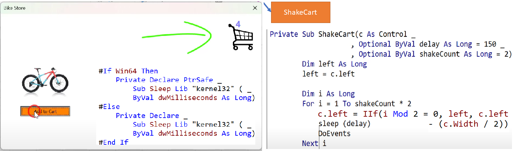
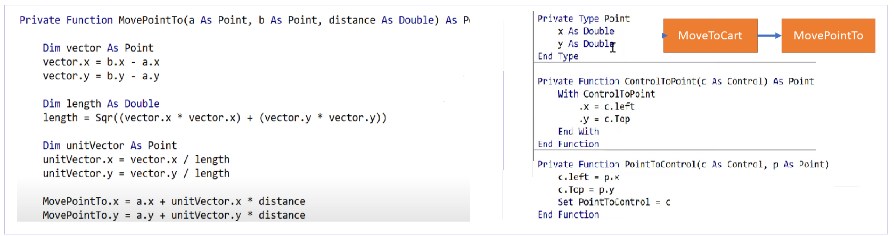
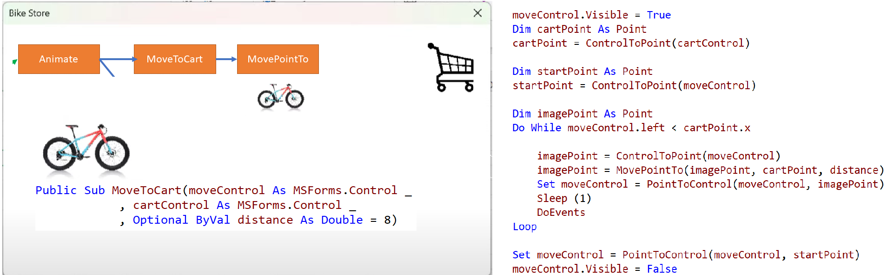

## How to Create Add-To-Cart Animation in VBA

#### Create the userformStore

- Creating the Store form & formatting

  
  
- Creating the UserForm_Initialize event

  
  
  
  
- Creating the Button_Click event
   
   

#### Creating the Cart Animation Class

- Basic Animate structure

  

- Performs the 'Shake cart' animation

  

- Performs the 'move to cart' animation

  - Type Point & Create Point Control exchange

    

  - Performs the  animation

    

​	

