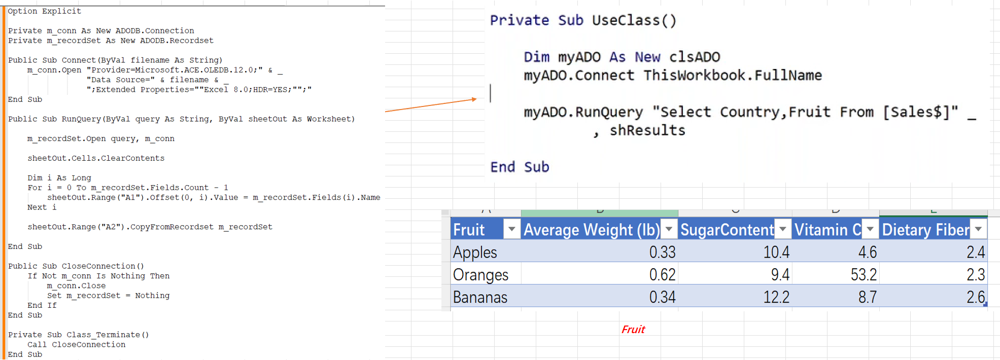

#### How to Create Powerful Data Queries

- Why querying data using standard VBA is problematic.

  

  1. Difficult for Filter Data: (Apples Fruit only ... etc)

    

  2. Select specific Fields Or Group data require too much code

    

  3. Join data is ....

- What is ADO and how can I use it.

  > **ADOdb** is a database abstraction library for [PHP](https://en.wikipedia.org/wiki/PHP), originally based on the same concept as Microsoft's [ActiveX Data Objects](https://en.wikipedia.org/wiki/ActiveX_Data_Objects).

  

- How to easily set up ADO using VBA code.

  

- Create a clsADO to simplify the query

  

- Example query – filtering data

  > "Select * From [Sales$] Where Fruit='Apples' and Country='USA'

- Example query – sorting data

  > "Select * From [Sales$] Order By Country, Fruit desc " 

- Example query – grouping data by date.

  > "Select Country, Fruit, " _
  > 	& "Sum([Quantity Sold]) AS Quantity From [Sales$] "Group By Country, Fruit "

- Example query – joining data

  

- Insert Into - add records

  